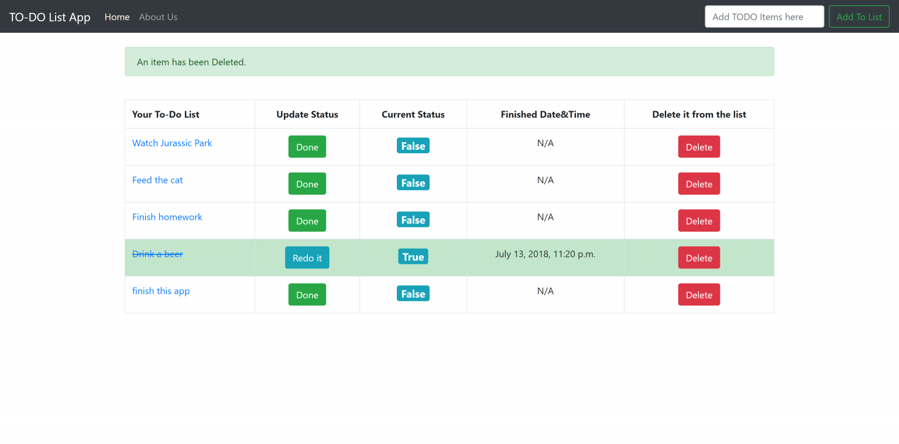

# todoList
The Homepage of the app is:

There existing four items are saved in database already.


You can use the text bar on the right topper corner to add 
something into the lists

After you click the ```Add TO List``` Button, an success message would pop up:


You can click the ```Delete``` Button anytime if you want to delete any item from the list

Similarly, a message will pop up and show the message is deleted.


Updated on July 13th:
-

- Changed the UI 
- Added table description for each colum
- Added feature, so user can cross the task by clicking ```DONE``` button
- Added feature, when user click the ```DONE``` button, the app will record the current
time and save it to database

Bugs Report:
-
- <s>The default timezone is set to UTC, need to change to CDT</s>
- Changed from UTC to 'America/Chicago' in settings.py, seems solve the problem, but
need to double check
- The finish time record part need implementation

TODO:
-
- Testing and add more features
- Create user login page


