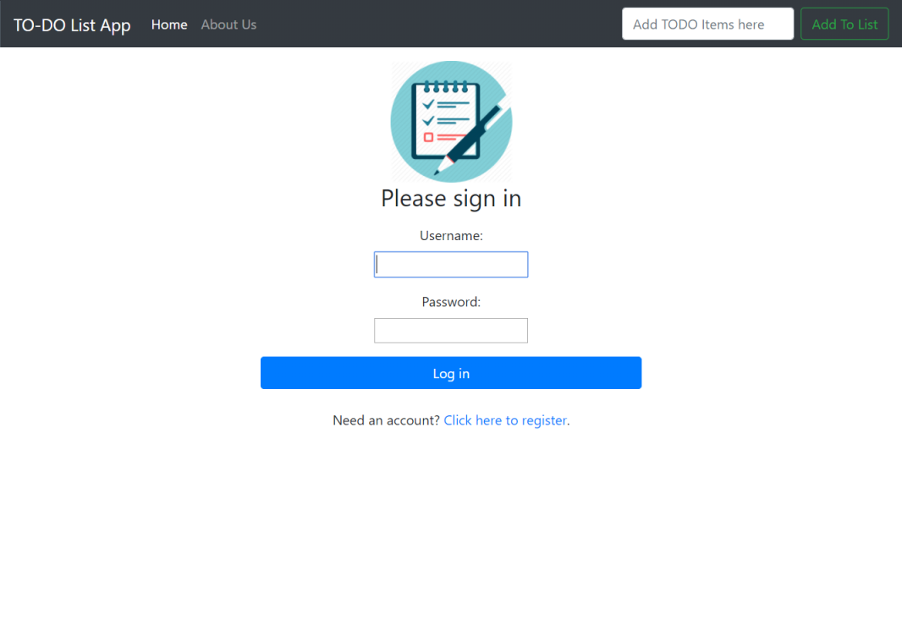
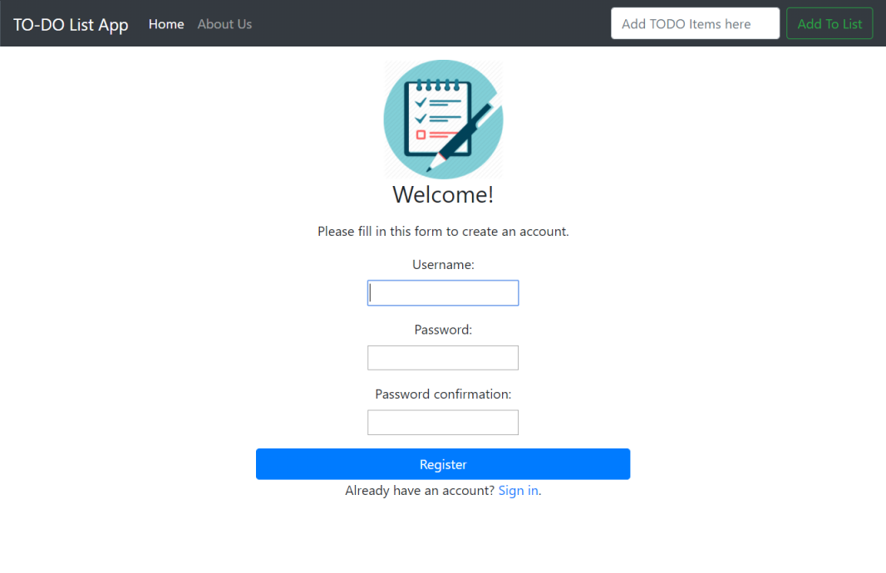

# todoList
The app is deployed at: 
http://zwang21.pythonanywhere.com/
Testing Account:
- Username: test
- Password: w123123123

The Homepage of the app is:

To add a TODO task into the list, use the textarea on the 
right top corner and click the ```Add TO List``` button

As shown followings, Some example tasks are added into the database


You can use the text bar on the right topper corner to add 
something into the lists

After you click the ```Add TO List``` Button, an success message would pop up:


You can click the ```Delete``` Button anytime if you want to delete any item from the list

Similarly, a message will pop up and show the message is deleted.


Updated on July 13th:
-
- Changed the UI 
- Added table description for each colum
- Added feature, so user can cross the task by clicking ```DONE``` button
- Added feature, when user click the ```DONE``` button, the app will record the current
time and save it to database
- Added feature, allow user to edit content of the list

Updates on July 16th:
-
- Added User Registration and User Login page


- Now, users have to login before accessing the TODO List App
- Added user control in database --- In previous version, all users have access to the only master database. 
- At the current version, each user only have access to the content created by themselves. 
They can not access information created by others.


Bugs Report:
-
- <s>The default timezone is set to UTC, need to change to CDT</s>
- Changed from UTC to 'America/Chicago' in settings.py, seems solve the problem, but
need to double check
- The finish time record part need implementation

TODO:
-
- Testing and add more features
- <s>Create user login page</s> (updated: on July 16th)


