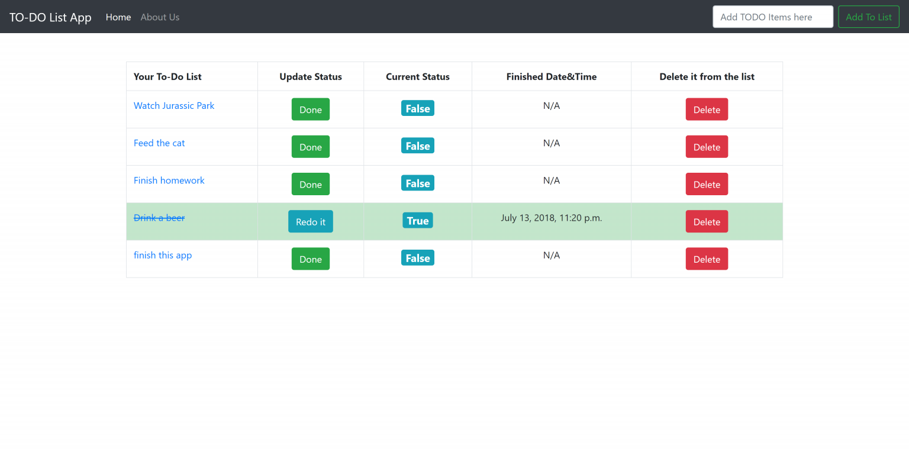

# todoList
The Homepage of the app is:

There existing four items are saved in database already.


You can use the text bar on the right topper corner to add 
something into the lists

After you click the ```Add TO List``` Button, an success message would pop up:


You can click the ```Delete``` Button anytime if you want to delete any item from the list

Similarly, a message will pop up and show the message is deleted.


